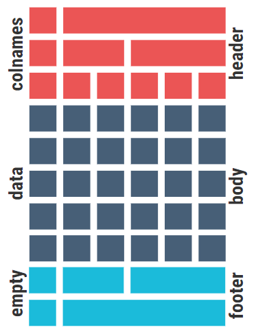

# Tables {#tables}

When thinking of data visualisations, tables may not be your first choice as they are not as visually remarkable as a graph. However, tables are a crucial tool in presenting data and results as they have the advantage of much greater specificity than graphs and are usually simple to understand. Generally, it is harder to read patterns in tables than in graphs. Therefore, graphs should be used when you want to focus on patterns, trends and relationships that do not necessarily require the exact values to be understood.

A table would therefore be more appropriate than a graph or map if:

*	You are asking the audience to compare individual values directly

*	You are wanting to include both the values and some derived measures such as percentages or indices. These are harder to show succinctly all together on one graph.

*	You want to include summary statistics such as means or totals

*	You need to show values with very different magnitudes together.

*	If users may want to use the data for their own analysis or reference.

**Reference tables** contain extensive information for people to look up. 

*	They are useful for archival purposes rather than analysis. 
*	They should include detailed metadata about the information presented: what, where and when of the data. 
*	They usually appear as appendices.

**Demonstration tables** are probably what you think of when we mention tables for research purposes. 

*	They are intended to reinforce a point by showing statistics or values that can be quickly assimilated by the reader. 

*	They are included within the text to allow readers to follow the general argument and without having to flip back and forth to refer to the relevant information. 

*	It is important they are clear and well-presented, usually using reasonable approximations to keep figures to a few significant figures.

*	Very large demonstration tables can be confusing and intimidating. If all the information is truly required, it should be split across multiple smaller tables.

The following guidance mostly concerns the formatting of demonstration tables although the general principles are applicable to both forms. 

Reference tables however are not designed to draw attention to specific numbers, patterns, or comparisons and therefore advice on topics such as ordering of columns and rows are not especially relevant.

## Introduction to Flextable

This section of the guide will be supplemented by reproducible code examples from R. These will be focusing on the incredibly useful package flextable which has been designed to help create report ready tables directly in R. It is especially useful for those intending to write their reports or knit their documents into Word format. This guide will mostly cover some of the basic features, for extended guidance on the full capabilities of flextable, please see this [guide](https://ardata-fr.github.io/flextable-book/)

In general, when using flextable the idea is to use R code to manipulate your data into roughly the format you wish to present as a table. In other words you create your table as a data frame. For purposes of demonstration, all data manipulation shown shall be done using the tidyverse range of packages, particularly dplyr and tidyr. 

Once you have your data in a desired format you can apply flextable functions to the data to create and design your table. Starting with `flextable()` to turn your data from a data.frame/tibble object into a flextable object.

A flextable object consists of 3 parts.

*  header: the section containing any and all headers/titles (defaults to column names of data frames in a single row)
*  body: this contains all of the data from the data frame
*  footer: not present by default but can be used to add footnotes or additional content

(ref:fourone) [Structure of a flextable object](https://ardata-fr.github.io/flextable-book/design.html#table-parts)

```{r, echo = FALSE, fig.cap = '(ref:fourone)', fig.width=8, fig.height=10, fig.align='center'}

```

```{r}
#install.packages("flextable")

library(flextable)
```

## General Guidance

### Title, column headers and labels

Titles and labels are very important to the design of a table as they help users understand what is being presented. The titles and labels make sure the table works on its own and can be read within a different context than its original presentation.

You should consider including the following information in tables within either titles, labels, headings or possible footnotes, the choice of which points depends on your data and how important the details are to understanding the information:

*	Analysis units (people, households etc.)
*	Types of statistics (totals, means etc.)
*	Units (thousands, kg, $)
*	Geographical coverage
*	Time period
*	Source of data
*	Key quality information

```{r}
Data <- read.csv("data/MathsGrades.csv")
```

```{r, message = FALSE, warning = FALSE, error = FALSE}
library(tidyverse)
```

```{r}
Data%>%
  group_by(Sex)%>%
  summarise(Mock.mean = mean(Mock),
            Final.mean = mean(Final),
            Failures.mean = mean(Failures))%>%
  flextable()
```

```{r}
Data%>%
  group_by(Sex)%>%
  summarise(Mock.mean = mean(Mock),
            Final.mean = mean(Final),
            Failures.mean = mean(Failures))%>%
  flextable()%>%
  set_header_labels(Mock.mean = "Mock Result (Mean)",
                    Final.mean = "Final Result (Mean)",
                    Failures.mean = "Failures (Mean)")%>%
  align(align = "center", part = "header")%>%
  add_header_lines(values = "Table 1a: Average Exam Results by Sex")%>%
  autofit()
```


