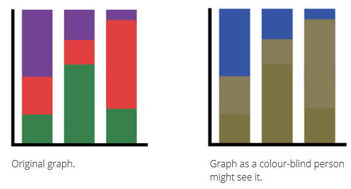
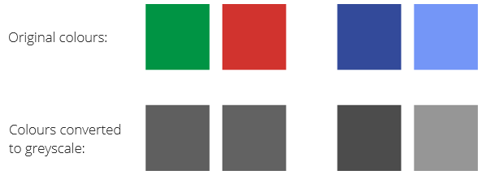
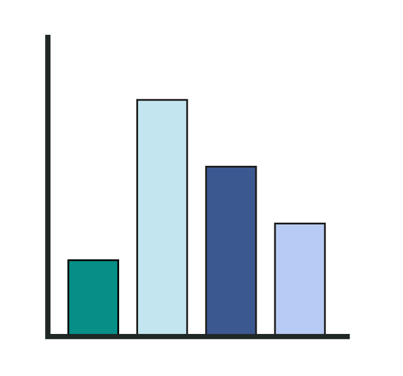

# Accessibility {#access}

The following advice is adapted from advice on accessibility published by the Government Statistical service [(GSS)](https://gss.civilservice.gov.uk/policy-store/introduction-to-data-visualisation/#section-8)

While we may have specific target audiences in mind when we write up our results and produce data visualisations, we should always aim to ensure inclusivity by making our content accessible to those with certain impairments. The GSS specifies impairments to vision, hearing, mobility and thinking & understanding as key areas to consider. For data visualisations, this primarily concerns those with vision and thinking impairments. These tips are designed to make your results as clear and readable as possible in general.

## Tables

*	Use column headers which explain the content of the columns, including measurement units where applicable.
*	Include derived variables (e.g., totals) at the end of columns or rows.
    +	Try to use more rows than columns.
*	Write out or clearly explain any acronyms.
*	Use table footnotes/captions to provide extra important information that cannot fit in the main body of the table.
*	If you do not need to use exact numbers, consider rounding larger numbers.

## Graphs/Maps

*	Write out or clearly explain any acronyms.
*	Make sure there is a clear distinction between lines on a line graph.
*	Do not use red and green together as it is difficult for colour-blind people to distinguish between them.

## Colour

Colour is one of the most useful tools for supplying extra information to maps and graphs, and sometimes even tables. It can be used to clearly highlight patterns and relationships that could be missed by a monochromatic visualisation. Adding colour can make visualisations more effective, but this only works if viewers can tell which colour is which. For instance, the graph presented here uses colours which are far too similar.

```{r, include=FALSE}
library(tidyverse)
```

```{r, include = FALSE}
library(scales)

MathsGrades <- read.csv("data/MathsGrades.csv")

MathsGrades <- MathsGrades%>%
  mutate(Ever_fail = ifelse(Failures>0, "None", "At least one"))
```

```{r, fig.cap = "The colours set on this plot are far too similair"}
ggplot(MathsGrades, aes(x = MotherEduc, fill = Ever_fail))+
  geom_bar(position = "fill", width = 0.8)+
  scale_fill_manual(values = c("#02A6AC", "#1385AC"))+
  scale_y_continuous(labels = percent)+ # requires the package "scales"
  labs(x = "Mother's Education Level",
       y = "Count",
       title = "Figure 3: Prevelance of Exam Failures amongst\nStudents by Level of Mother's Education",
       fill = "Previous \nExam Failures?",
       caption = "Source: Example Data Source (2020)")+
  theme_minimal()
```

Previous advice already presented on the use of colour in graphs and maps (using it to highlight, use it sparingly etc.) are still relevant and contribute to ensuring accessibility. The advice presented here tends to focus on the choice of colours themselves.

*	Ensure the colours are accessible. 

    +	Colour blindness affects an individual’s ability to distinguish between certain colours. It affects men more commonly than women. 
  
    +	Most commonly, it affects the ability to distinguish reds and greens. Avoid using these colours together. Less commonly, but to be      considered, is blue-yellow colour blindness. The two graphs below demonstrate how a colour-blind person may see a graph using red and green. The   colours are much harder to distinguish.
 
    +	Red-green colour palettes may also not be clear when printed in greyscale.

    +	Blue palettes are a safe default starting point as they are colour blind safe and are visible in grayscale, as shown in the picture below.

```{r, out.width="100%", echo = FALSE, fig.cap = "A demonstration of how a colour-blind person would see a colourful graph"}

```

```{r, out.width="100%", echo = FALSE, fig.cap = "Side by side comparison of colours converted to greyscale"}

```

*	Choose colours carefully.

    +	Consider cultural context. Colours often have some inherent culturally defined associations. For instance, using colours people associate with familiar concepts can improve the quality and speed of information processing, such as using blue for water on a map.
    
```{r, out.width="100%", echo = FALSE, fig.cap = "Using colours logically"}

```    

* Understand the digital colour palette

    + Colours are represented using several common schemes. The most useful of these considers hue, saturation, and luminance. This scheme allows us to intuitively define unique colours.
    
*  **Hue** – Hues are colours. They do not have a natural order and therefore users cannot assign a logical order to them. Small changes in hue are easy to detect although colour blindness can affect how well people can detect these differences.  

```{r, out.width="100%", echo = FALSE, fig.cap = "Hue"}

```    

*	**Saturation** – This is the intensity of a colour, ranging from grey/white (no saturation) to rich, vibrant, almost glowing colour. Saturation is perceived on a continuous scale, although it is difficult to detect small changes. High saturation can also cause issues for those with certain visual/light sensitivity problems.

```{r, out.width="100%", echo = FALSE, fig.cap = "Saturation"}

``` 

*	**Luminance** – the brightness of colour. Also perceived as continuous ordered scale from dark to light. This natural order can help us optimize colour schemes for maximum distinction and differentiation.
    +	Changes are easier to detect
    + It is easier to distinguish between bars even if luminance is the only difference.
    + Changes in luminance need to be larger if creating a line graph as the white space between the lines makes it harder to quickly compare.

```{r, out.width="100%", echo = FALSE, fig.cap = "Luminance"}

```     
    
* Never use an image as a background. This looks messy and cluttered and can make it difficult to read the graph.

```{r, echo = FALSE, message = FALSE, warning=FALSE, fig.cap = "Using a background image in a plot"}
library(ggpubr)
library(ggimage)
library(magick)
library(jpeg)

img = readJPEG("img/stockphot.jpg")

ggplot(MathsGrades, aes(x = MotherEduc, fill = Ever_fail))+
  background_image(img)+
  geom_bar(position = "fill", width = 0.8)+
  scale_fill_manual(values = c("#A8A985", "#545E8D"))+
  scale_y_continuous(labels = percent)+
  labs(x = "Mother's Education Level",
       y = "Count",
       title = "Figure 3: Prevelance of Exam Failures amongst\nStudents by Level of Mother's Education",
       fill = "Previous \nExam Failures?",
       caption = "Source: Example Data Source (2020)")+
  theme_minimal()+
  theme(
        plot.title = element_text(margin = margin(0,0,25,0),
                                  hjust = 0.5,
                                  size = 18),
        axis.title.x = element_text(margin = margin(25,0,0,0)),
        axis.title.y = element_text(margin = margin(0,20,0,0)),
        plot.caption.position = "plot",
        axis.text = element_text(size = 12),
        axis.title = element_text(size = 14),
        legend.text = element_text(size = 12),
        legend.title = element_text(size = 14))
```

* Know how to use colour effectively

    + Alternate colours – consider alternating dark and light for categorical data to improve clarity and distinction.
    + Use borders – adding thin borders to the edges of bars can enhance clarity/separation.
    
```{r, out.width="100%", echo = FALSE, fig.cap="Use of alternating colours and borders"}

``` 
    
* Avoid overuse of saturated colours.
    + Mid to low saturations are preferred
    + Only use bold saturated colour to draw attention to a specific piece of information or hard to see, small elements.
    + Bold, saturated colours can have visual side-effects. They may appear to glow for many users, can generate after-images and can affect how other colours appear.
    
```{r, fig.cap="Over Saturated Colours on a graph"}
ggplot(MathsGrades, aes(x = MotherEduc, fill = Ever_fail))+
  geom_bar(position = "fill", width = 0.8)+
  scale_fill_manual(values = c("#03F8FF", "#FF3360"))+
  scale_y_continuous(labels = percent)+
  labs(x = "Mother's Education Level",
       y = "Count",
       title = "Figure 3: Prevelance of Exam Failures amongst\nStudents by Level of Mother's Education",
       fill = "Previous \nExam Failures?",
       caption = "Source: Example Data Source (2020)")+
  theme_minimal()
```

    
```{r, fig.cap = "Low saturation makes the graph more pleasant to look at"}
ggplot(MathsGrades, aes(x = MotherEduc, fill = Ever_fail))+
  geom_bar(position = "fill", width = 0.8, colour = "black")+
  scale_fill_manual(values = c("#60BDC0", "#C07384"))+
  scale_y_continuous(labels = percent)+
  labs(x = "Mother's Education Level",
       y = "Count",
       title = "Figure 3: Prevelance of Exam Failures amongst\nStudents by Level of Mother's Education",
       fill = "Previous \nExam Failures?",
       caption = "Source: Example Data Source (2020)")+
  theme_minimal()
```
    
* Use colour logically and consistently. If using sequences of colours, ensure that they progress in a logical manner that the user would expect, such as increasing luminance like in the map on page 50.

    + If creating multiple graphs, use the same colour to mean the same thing. Changing what they mean can confuse the user.
    
* Use a white background.    

    + Most palettes are designed to appear on top of a white background. It provides a helpful reference for the colour scale being used.
    
## Using colour in ggplot2

ggplot2 comes with a wide array of capabilities to control the colour of various aspects of a graph. There are two main ways to add colour to a plot, either by allowing plotted objects (bar, points etc.) to vary according to a specified variable in your data or by simply setting something as a static colour.

To use a variable to define your colours, you include either `fill = variable` or `colour = variable` in the aesthetic mapping of your plot. `fill` refers to the space within objects/shapes such as the whitespace within a boxplot or a bar, while `colour` tends to refer to borders or points. 

In the example below, we have assigned the `fill` of the column to vary according to the HHTYPE variable. Thereby turning the normal bar graph into a stacked bar graph.

```{r, echo = FALSE}
BeanSurvey <- readRDS("data/bean_survey.RDS")
```

```{r, fig.cap = "Using fill (barchart)"}
ggplot(BeanSurvey, aes(x = VILLAGE, y = ADULTS, fill = HHTYPE))+
  geom_col()
```

As we can see below the same idea does not really work if we tried the colour argument instead.

```{r, fig.cap = "Using colour (barchart)"}
ggplot(BeanSurvey, aes(x = VILLAGE, y = ADULTS, colour = HHTYPE))+
  geom_col()
```

Colour is better suited to graphs such as a scatterplot. In this case the plot has been jittered to avoid overplotting.

```{r, fig.cap = "Using colour (scatter/jitterplot)"}
ggplot(MathsGrades, aes(x = Mock, y = Final, colour = Sex))+
  geom_jitter()
```

Again, this doesn't work when we try the reverse with fill.

```{r, fig.cap = "Using fill (scatter/jitterplot)"}
ggplot(MathsGrades, aes(x = Mock, y = Final, fill = Sex))+
  geom_jitter()
```

If we don't wish to allow colour to vary according to a variable in our data but rather set all objects to the same colour (other than the default grey/black), then we set the colour inside of the specific geom instead and not within a call to `aes()`. We can assign the colour using a hex code e.g. `fill = "#CD0000"` for a deep shade of red or by using the name of a pre-defined ggplot2 colour such as `colour = "dodgerblue4"`. You can find a list of all ggplot2 colours and additional information on colour scales [here](http://sape.inf.usi.ch/quick-reference/ggplot2/colour). Another useful site for finding good colours, especially their appropriate hex codes can be found [here](https://alloyui.com/examples/color-picker/hsv.html)

```{r, fig.cap="Setting fill with hex code"}
ggplot(BeanSurvey, aes(x = VILLAGE, y = ADULTS))+
  geom_col(fill = "#CD0000")
```

```{r, fig.cap = "Setting colour with named colour"}
ggplot(MathsGrades, aes(x = Mock, y = Final))+
  geom_jitter(colour = "dodgerblue4")
```


### Changing the colour/fill scale

### Setting colours manually

